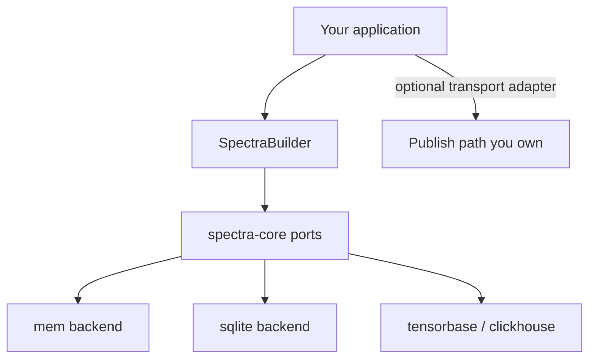

# Spectra

[](https://github.com/unified-field-dev/spectra/actions/workflows/ci.yml)
[](https://crates.io/crates/uf-spectra)
[](https://docs.rs/uf-spectra)
[](LICENSE)

[GitHub](https://github.com/unified-field-dev/spectra) · [crates.io](https://crates.io/crates/uf-spectra) · `cargo doc -p uf-spectra --features mem --open` · [Benchmarks](docs/bench/PERFORMANCE_STUDY.md)

**Spectra** is a Rust observability library built around **declarative schemas** and **ergonomic typed logging APIs** — counters, gauges, and structured event logs with the same emit surface whether you run **embedded** in one process or across a **large multi-service cluster**. Wire storage at build time via **`Spectra::builder()`** — composable adapters behind thin async ports, in the spirit of [Continuum](https://github.com/unified-field-dev/continuum) and [Photon](https://github.com/unified-field-dev/photon).

*Declarative schemas and typed logging APIs — same surface from embedded to multi-service.*

**Status:** tag `v0.1.0` · [MIT](LICENSE) · [GitHub](https://github.com/unified-field-dev/spectra)

## Schema and metric DSL

Define event schemas and metrics with proc macros:

```rust
use spectra_macros::{spectra_metric, spectra_schema};

spectra_schema! {
    RequestDebugLog {
        store: "default",
        table: "request_debug_log",
        version: "0.1.0",
        description: "Structured debug events for request tracing",
        fields: [
            message: {
                r#type: String,
                classification: { pii: false, safe_for_console: true },
            },
        ],
    }
}

spectra_metric! {
    CacheHits {
        store: "default",
        name: "cache_hits",
        version: "0.1.0",
        description: "Counter for cache hit events",
    }
}
```

Each `spectra_schema!` / `spectra_metric!` expands inventory registration, typed
`*Recorder` / `*Logger` helpers, and transport `*Payload` / `*_TOPIC` DTOs. Link schema
modules with a normal `mod` list — no `build.rs`. See the `spectra` crate Getting Started.

## Architecture



Your application owns identity, routing, and business logic. Spectra owns observability semantics: classification metadata, emit buffering, registry discovery, and query DTOs. Storage engines live in feature-gated `spectra-backend-*` crates.

**Topology vocabulary:** **embedded** (in-process store) vs **remote** (network-backed store). Assembly uses builder methods — not a global deployment mode enum.

## Quick start

The crates.io package is **`uf-spectra`** (`spectra` is taken). With `[lib] name = "spectra"`, imports stay `use spectra::…`:

```toml
[dependencies]
spectra = { package = "uf-spectra", version = "0.1.0", features = ["mem"] }
# or: cargo add uf-spectra --features mem
# git pin: spectra = { package = "uf-spectra", git = "https://github.com/unified-field-dev/spectra.git", tag = "v0.1.0", features = ["mem"] }
tokio = { version = "1", features = ["rt-multi-thread", "macros"] }
```

```rust
use std::sync::Arc;
use spectra::{MemEventsBackend, MemMetricsBackend, Spectra};

#[tokio::main]
async fn main() -> spectra::Result<()> {
    let spectra = Spectra::builder()
        .metrics_backend(Arc::new(MemMetricsBackend::new()))
        .events_backend(Arc::new(MemEventsBackend::new()))
        .embedded()
        .build()?;
    let _ = spectra;
    Ok(())
}
```

### Transport + storage

```rust
use std::sync::Arc;
use spectra::{MemEventsBackend, MemMetricsBackend, RecordingSink, Spectra, SpectraSink};

let transport = Arc::new(RecordingSink::new());
let spectra = Spectra::builder()
    .metrics_backend(Arc::new(MemMetricsBackend::new()))
    .events_backend(Arc::new(MemEventsBackend::new()))
    .sink(Arc::clone(&transport) as Arc<dyn SpectraSink>)
    .embedded()
    .build()?;
// Emits fan out to transport synchronously, then async storage persist (default).
```

See [`spectra/examples/quickstart_transport.rs`](spectra/examples/quickstart_transport.rs) for a runnable dual-path demo.

## Logging surfaces

| Surface | What it is | Topic / path |
|---------|------------|--------------|
| Metrics | High-volume counters, gauges, histograms | `spectra.metric.{name}` |
| Events | Typed structured event rows | `spectra.event.{table}` |
| Batched partition exports | Batch jobs that write partition snapshots into event storage | **Your application** — outside this library; use the event sink / adapters |

## Cargo features

| Feature | Backend | Notes |
|---------|---------|-------|
| `mem` | `spectra-backend-mem` | **Default** — quick start, non-durable |
| `sqlite` | `spectra-backend-sqlite` | Durable embedded for tests and examples |
| `tensorbase` | `spectra-backend-tensorbase` | Scale-out adapter |
| `clickhouse` | `spectra-backend-clickhouse` | Remote / multi-node adapter |
| `telemetry-console` | Console / NDJSON sinks | Optional dev telemetry |

### Limitations (read before integrating)

| Capability | Status |
|------------|--------|
| Event chart aggregates (`query_aggregate`) | **Stub** — returns empty series on sqlite and remote backends; `Count` only on mem |
| Batched partition exports | **Your application** — batch export jobs live outside this library |
| CI demo schemas (`platform_smoke_*`) | Illustrate macros + inventory; define product schemas in your repo |

## Workspace crates

| Crate | Role |
|-------|------|
| `uf-spectra-core` (`spectra_core`) | Traits, router, registry, emit buffer, query DTOs |
| `spectra-macros` | `spectra_schema!`, `spectra_metric!` (helpers + topics + inventory) |
| `spectra-backend-*` | Feature-gated storage adapters |
| `spectra-runtime` | `SpectraBuilder`, composite sink, install |
| `uf-spectra` (`spectra`) | Primary public crate |
| `spectra-testkit` / `spectra-e2e` / `spectra-bench` | Matrix verification and benchmarks |

## Documentation

| Doc | Audience |
|-----|----------|
| `cargo doc -p uf-spectra --all-features --open` | API reference, Getting started modes (direct vs publisher/consumer), examples |
| [`spectra/README.md`](spectra/README.md) | Feature flags, configuration, backend wiring |
| [`spectra/examples/`](spectra/examples/) | Runnable flows including publish-only and consume-forward |
| [`docs/bench/EXPERIMENTS.md`](docs/bench/EXPERIMENTS.md) | Benchmark registry and CLI |
| [`docs/bench/PERFORMANCE_STUDY.md`](docs/bench/PERFORMANCE_STUDY.md) | Performance study |
| Per-crate READMEs | Crate-specific entry points |

### Maintainers

- [CONTRIBUTING.md](CONTRIBUTING.md) — verify commands before PRs

## Development

```bash
./scripts/verify-release.sh
```

### Local ClickHouse smoke (Docker)

```bash
docker compose -f docker-compose.dev.yml up -d clickhouse
export SPECTRA_CLICKHOUSE_URL=http://127.0.0.1:8123
cargo run -p uf-spectra --example quickstart_clickhouse_emit --features clickhouse
```

A workspace [`Dockerfile`](Dockerfile) and [`.devcontainer/`](.devcontainer/) are available for containerized development.
