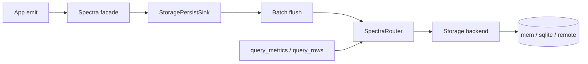

# Spectra performance study

Pre-registered workloads and runner commands: [EXPERIMENTS.md](EXPERIMENTS.md). Bench CLI: [spectra-bench/README.md](../../spectra-bench/README.md).

---

## Executive summary

Spectra is a **metrics and event-log observability library** for Rust services. Apps emit via `spectra_metric!` / `spectra_schema!`; storage adapters (`mem`, `sqlite`, `tensorbase`, `clickhouse`) persist and serve queries.

**Decision-grade durable write capacity** (Spectra → ClickHouse on AWS) is the L2 batched path **BM-SW7**:

| Path | durable_counter_ops_per_sec | Notes |
|------|----------------------------|-------|
| Single-row floor (BM-SW5) | ~0.8k | One awaited insert per op |
| L2 batch `batch_max=2048`, 1 writer | **~38k** | Canonical high-throughput path |
| L2 batch `batch_max=2048`, 2 writers (agg) | **~48k** | Same writer host |

Hardware: **`aws-t3-xlarge`**. Reports: [`profiling/spectra-bench/reports/`](../../profiling/spectra-bench/reports/).

Fire-and-forget full-stack rates (BM-SW1 remote ~600k) are **enqueue**, not durable — see [Dead ends](#dead-ends).

### Sizing questions this study answers

1. How many **durable** counter rows/s can Spectra land in ClickHouse on one writer (L2 batch)?
2. How does that compare to the **single-row** protocol floor?
3. How much does the Spectra runtime add above raw adapter `record_counter` (enqueue path)?
4. What **query latency** should we expect at measured table depths?

---

## Metric tracks (do not mix)

| Track | Experiment IDs | Primary metric | Use |
|-------|----------------|----------------|-----|
| **Batched durable write** | BM-SW7 | `durable_counter_ops_per_sec` | High-throughput Spectra→DW sizing |
| **Protocol floor** | BM-SW5 (footnote) | `durable_counter_ops_per_sec` | Single-row insert shape only |
| **Enqueue / runtime** | BM-SW0..SW4 | `achieved_*_ops_per_sec` | Not durable on remote |
| **Query capacity** | BM-SQ0..SQ3 | `query_*_ms` percentiles | Prefill + timed query |
| **Smoke** | BM-S0..S3 | per-step `elapsed_ms` | CI / release regression |

---

## Research questions

| RQ | Question | Experiment |
|----|----------|------------|
| RQ-D1 | L2 batched durable ceiling (ClickHouse) | BM-SW7 |
| RQ-D2 | Single-row durable floor (why batching exists) | BM-SW5 |
| RQ-W1 | Adapter vs full-stack enqueue | BM-SW0, BM-SW1 |
| RQ-W2 | Event enqueue hammer | BM-SW4 |
| RQ-Q1 | Query latency at empty / depth | BM-SQ0, BM-SQ1 (measured cells) |
| RQ-Q2 | Label filter / event scan | BM-SQ2, BM-SQ3 |
| RQ-P1 | Smoke emit / persist / query | BM-S0..S3 |

---

## Authoritative test environment (AWS)

Decision-grade numbers come from EC2 campaigns only:

| Campaign | Infra | Role |
|----------|-------|------|
| Co-located matrix | [`infra/aws/spectra/`](../../infra/aws/spectra/) | mem/sqlite/CH/TB enqueue + query baselines |
| Multi-DW durable | [`infra/aws/spectra-multidw/`](../../infra/aws/spectra-multidw/) | Separate writer + DW; BM-SW7 primary |

| Field | Value |
|-------|-------|
| **Hardware** | `aws-t3-xlarge` (`SPECTRA_BENCH_HARDWARE`) |
| **Topology** | `embedded` (mem/sqlite); `remote-ingest` (tensorbase/clickhouse) |
| **Telemetry** | `off` for capacity |
| **Duration** | 15–30s firehose (see report JSON) |
| **Reports** | [`profiling/spectra-bench/reports/`](../../profiling/spectra-bench/reports/) (`*-aws-t3-xlarge.json` only) |

```bash
# Co-located baselines
cd infra/aws/spectra
./provision.sh && ./bootstrap.sh
./deploy-and-run-bench.sh && ./fetch-reports.sh && ./teardown.sh

# Durable L2 batch (BM-SW7)
cd infra/aws/spectra-multidw
export SPECTRA_MULTIDW_DW_KIND=clickhouse SPECTRA_BENCH_DW_N=1
./provision.sh && ./bootstrap.sh
./deploy-and-run.sh && ./fetch-reports.sh && ./teardown.sh
```

---

## Primary scoreboard — batched durable (BM-SW7)

**Path:** `try_record_*_now` → L2 `StoragePersistSink` (`PersistConfig.batch_max`) → `flush_persist` → query visibility. Stamp: `l2-batch`.

JSON: [`multidw-bm-sw7-clickhouse-n1-*-aws-t3-xlarge.json`](../../profiling/spectra-bench/reports/) + [`multidw-bm-sw7-clickhouse-n1-aggregate-summary.json`](../../profiling/spectra-bench/reports/multidw-bm-sw7-clickhouse-n1-aggregate-summary.json).

**Conditions:** ClickHouse n=1, separate writer EC2, C=64, 15s, `aws-t3-xlarge`.

| writers | batch_max | durable_counter_ops_per_sec | Notes |
|---------|-----------|----------------------------|-------|
| 1 | 32 | 566 | Dead-end cell — ≈ single-row floor |
| 1 | 512 | 17,053 | Useful |
| 1 | **2048** | **37,974** | Best single-writer cell |
| 2 | 512 | 25,158 (agg) | ~12.4k + ~12.8k |
| 2 | **2048** | **48,268 (agg)** | ~24.1k + ~24.1k |

Recommended sweep: `batch_max ∈ {512, 2048}` (omit 32 for capacity). Raise `PersistConfig.batch_max` on `Spectra::builder()` for firehose hosts (library default `32` is latency-oriented).

`binding_tier` was `unset` (CPU headroom). Use only `binding_tier = dw` cells for hard DW instance projection when available.

### Campaign knobs

| Knob | Source | Recommended |
|------|--------|-------------|
| `batch_max` | `--batch-max` / `SPECTRA_BENCH_BATCH_MAX` | 512, 2048 |
| Writer ladder | `SPECTRA_BENCH_WRITER_LADDER` | `1,2` |
| Infra sweep | `SPECTRA_BENCH_BATCH_SWEEP` | `512,2048` |

---

## Protocol floor — single-row durable (BM-SW5)

Awaited one-insert-per-op Spectra→DW (`subscriber-sim`). Explains why L2 batching exists; **not** the sizing path.

Same-session CH n=1: **~773** durable counter ops/s (`multidw-bm-sw5-clickhouse-n1-shard0-aws-t3-xlarge.json`). Earlier campaign cell ~832.

BM-SW6 (events) is the same insert shape for events. Do not size fleets from SW5/SW6 n=2 efficiency tables.

---

## Enqueue baselines (non-durable) — AWS `aws-t3-xlarge`

BM-SW0 calls the adapter directly; BM-SW1 is full-stack `*_now` enqueue. On **remote** storages, SW1 can look “fast” while `persist_queue_drops` are huge — that is **not** durable throughput.

### Write enqueue (BM-SW1, 30s, C=16)

| Storage | Topology | achieved_counter_ops_per_sec |
|---------|----------|------------------------------|
| mem | embedded | 635,615 |
| sqlite | embedded | 757,117 |
| tensorbase | remote-ingest | 578,077 |
| clickhouse | remote-ingest | 674,203 |

### Adapter-direct vs full-stack (BM-SW0 vs BM-SW1)

| Storage | Topology | BM-SW0 ops/s | BM-SW1 ops/s |
|---------|----------|--------------|--------------|
| mem | embedded | 333,397 | 635,615 |
| sqlite | embedded | 103.7 | 757,117 |
| tensorbase | remote-ingest | 46.1 | 578,077 |
| clickhouse | remote-ingest | 347.5 | 674,203 |

### Query at depth (BM-SQ1, query_iters=100)

Measured cells only (no empty placeholders).

| Storage | Topology | prefill | query_metrics_ms p50 | query_metrics_ms p95 |
|---------|----------|---------|----------------------|----------------------|
| mem | embedded | 1_000 | 0.573 | 0.681 |
| mem | embedded | 10_000 | 11.2 | 11.7 |
| mem | embedded | 100_000 | 118.4 | 123.7 |
| sqlite | embedded | 1_000 | 5.478 | 5.749 |
| sqlite | embedded | 10_000 | 56.2 | 61.2 |
| sqlite | embedded | 100_000 | 517.1 | 556.8 |
| tensorbase | remote-ingest | 1_000 | 54.8 | 61.0 |
| tensorbase | remote-ingest | 10_000 | 153.9 | 163.7 |
| clickhouse | remote-ingest | 1_000 | 295.9 | 311.4 |
| clickhouse | remote-ingest | 10_000 | 349.1 | 369.7 |

---

## Architecture



Canonical durable path: `*_now` → L2 batch → DW. BM-SW0 bypasses facade for adapter-direct comparison.

---

## Dead ends

Do not revive these as capacity conclusions:

| Dead end | Why |
|----------|-----|
| Size DW fleets from BM-SW5/SW6 single-row rates (~0.8k) | RTT-bound insert shape; product path is L2 batch (SW7) |
| Treat BM-SW1 remote ~600k as durable | Enqueue only; check `persist_queue_drops` |
| Scoreboard `batch_max=32` for capacity | ≈ single-row floor; use 512+ |
| n=2 DW / TensorBase TBD cells for SW7 | CH n=1 already shows the L2 ceiling; TB was writer-bound on single-row |
| Local / WSL / `SPECTRA_BENCH_HARDWARE=local` scoreboards | Decision-grade is AWS `*-aws-*.json` only |
| Env `SPECTRA_PERSIST_*` knobs | Removed; use `SpectraBuilder::persist(PersistConfig)` |
| Coupling Spectra capacity docs to other products | Spectra is a standalone library — frame Spectra→DW only |

---

## Related docs

- [EXPERIMENTS.md](EXPERIMENTS.md) — experiment registry and CLI
- [spectra-bench/README.md](../../spectra-bench/README.md) — harness usage
- [infra/aws/spectra/README.md](../../infra/aws/spectra/README.md) — co-located AWS campaign
- [infra/aws/spectra-multidw/README.md](../../infra/aws/spectra-multidw/README.md) — durable multi-DW / BM-SW7 campaign
